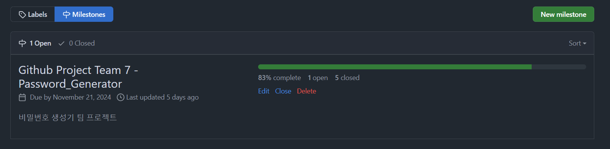
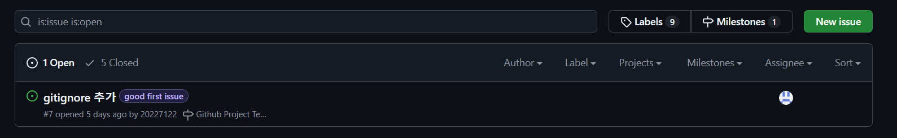
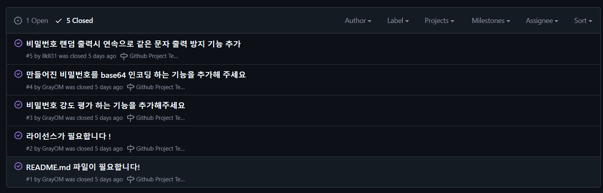
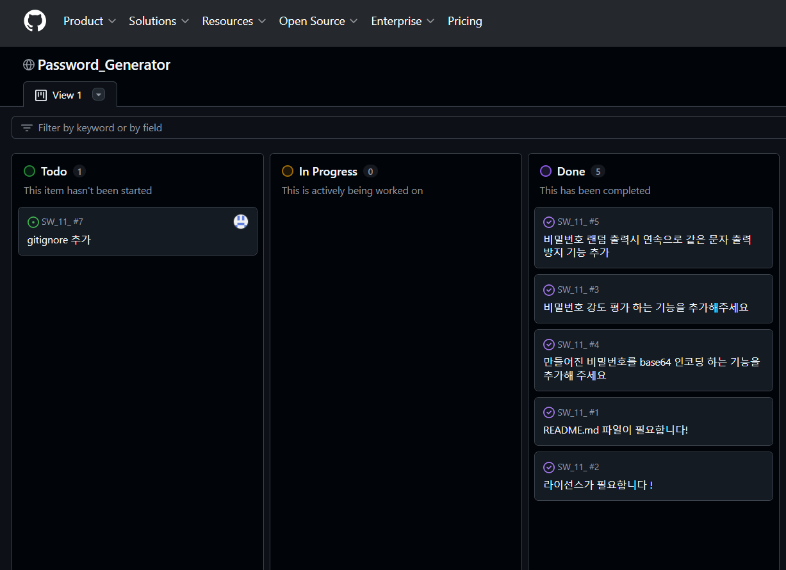
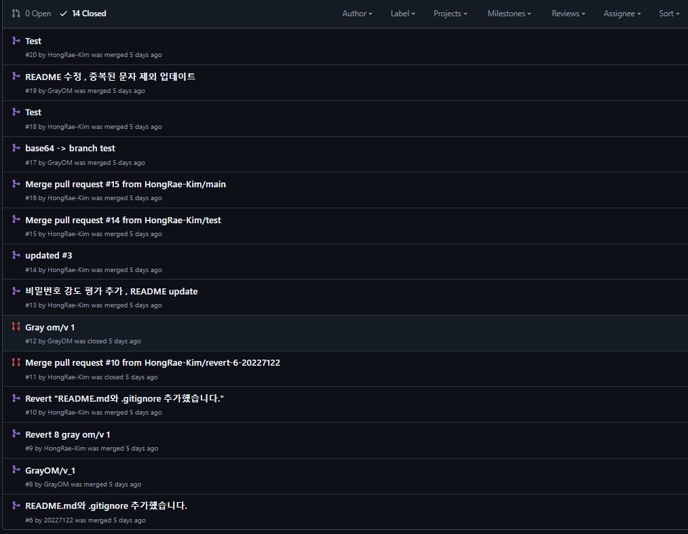

## 보고서 제출:

====

🛠️ 7조_오픈소스SW의이해_깃헙프로젝트.pdf

====

내용:

- 20227122 윤태근
- 20217142 김홍래
- 20217144 박승민
- 20206602 강석훈
- 20233251 정종현

### 1) 프로젝트 소개 
## 🔐 비밀번호 생성기 및 강도 평가 프로그램

이 프로젝트는 사용자가 원하는 **랜덤 비밀번호**를 생성하며, 비밀번호 강도를 다양한 기준으로 평가해 보안을 높일 수 있도록 돕습니다. 각 비밀번호는 **Base64 인코딩**을 적용해 안전하게 관리할 수 있으며, **연속된 동일한 문자가 나오지 않도록** 설계되었습니다.

---

### 💡 사용 방법:
1. **비밀번호 개수 입력**: 생성할 비밀번호의 개수를 입력합니다.
2. **비밀번호 길이 입력**: 원하는 비밀번호 길이를 입력합니다.
3. 프로그램이 랜덤 비밀번호를 생성하고, 각 비밀번호에 대해 강도를 다음과 같이 평가합니다:
   - `약함` | `보통` | `강함` | `매우 강함`
4. 각 비밀번호는 **Base64 인코딩**된 버전으로도 제공됩니다.
5. 비밀번호는 **연속된 동일한 문자가 포함되지 않도록** 생성됩니다.

---

### 🔍 비밀번호 강도 평가 기준:
- **매우 강함**: 길이가 12자 이상이며 대소문자, 숫자, 특수문자가 모두 포함된 경우
- **강함**: 길이가 8자 이상이며 대소문자, 숫자, 특수문자가 모두 포함된 경우
- **보통**: 길이가 6자 이상이며 대소문자, 숫자, 특수문자가 3개 이상 포함된 경우
- **약함**: 그 외의 경우

---

### 🔑 기능 설명
1. **비밀번호 강도 평가**: 비밀번호의 강도를 **대소문자, 숫자, 특수 문자 포함 여부**에 따라 평가하여 출력합니다.
2. **Base64 인코딩**: 생성된 비밀번호를 **Base64**로 인코딩하여 인코딩된 버전도 제공합니다.
3. **연속된 동일 문자 방지**: 비밀번호 생성 시 연속된 동일 문자가 나오지 않도록 처리하여 보안을 강화합니다.

---

### 📃 예시 출력:
```
 생성된 비밀번호: ABc@12xy -> 강도: 강함 -> Base64 인코딩: QUJjQDEyeHk= 
 생성된 비밀번호: dZ8?LmNo5 -> 강도: 매우 강함 -> Base64 인코딩: ZFo4P0xtTm8=

 ```
### 2) Milestone

### 3) Open 상태인Issue

### 4) Closed 상태인Issue

### 5) 최종적Project 보드

### 6) Requirements.txt
### 7) PR탭화면

### 8) 실행화면

### 부록: